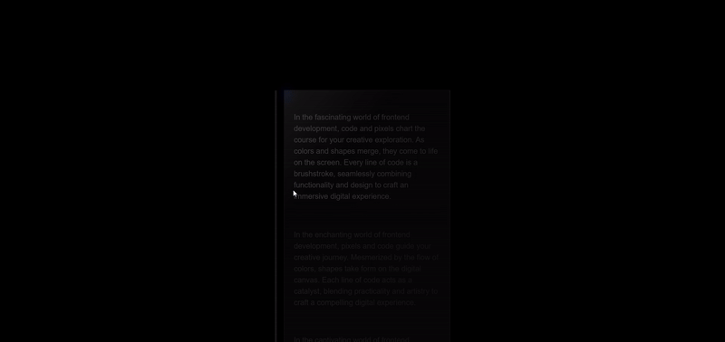
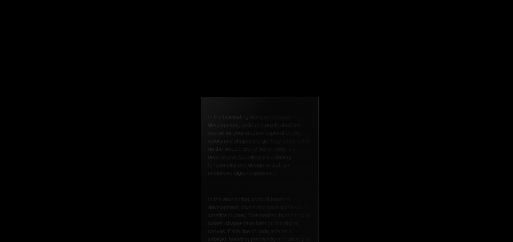
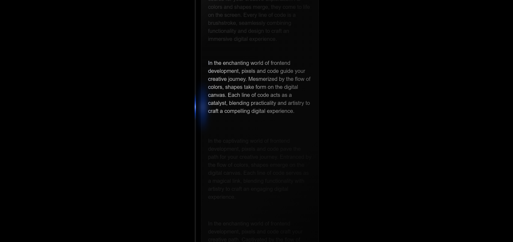
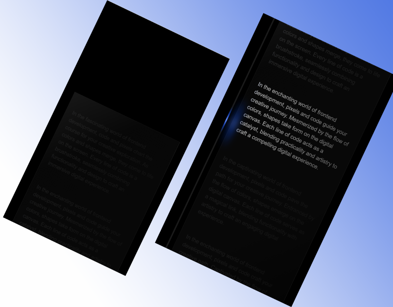

# GlowScroll: Illuminated Scrolling with Pure CSS

<a href="https://www.linkedin.com/in/dharmendraverma95/" target="_blank">LinkedIn Profile </a>

<a href="https://www.behance.net/dhirukumar" target="_blank">Behance Profile </a>

# GlowScroll: Illuminated Scrolling with Pure CSS

Welcome to **GlowScroll**! This project demonstrates how to create an eye-catching illuminated scrolling effect using **pure CSS**. No JavaScript is needed—just the power of CSS animations to create a glowing, interactive scrolling experience for your web pages.

## Features
- **CSS-Only Solution**: Achieve stunning light scrolling effects with zero JavaScript.
- **Customizable Design**: Easily tweak colors, timing, and animations to fit your design needs.
- **Smooth, Fluid Animation**: Experience smooth transitions and engaging scrolling effects.

# Preview
GlowScroll: Illuminated Scrolling with Pure CSS
 

 
GlowScroll: Illuminated Scrolling with Pure CSS 
 

 
Cover
 

 
###### Technologies Used

<ul>
  <li>Graphic Design Software: Adobe Illustrator, Photoshop, Figma (for mockups)</li>
  <li>Web Tools (Optional): HTML, CSS for any digital presentations or landing pages</li>
  <li>Font Awesome (Optional for icons)</li>

</ul>

